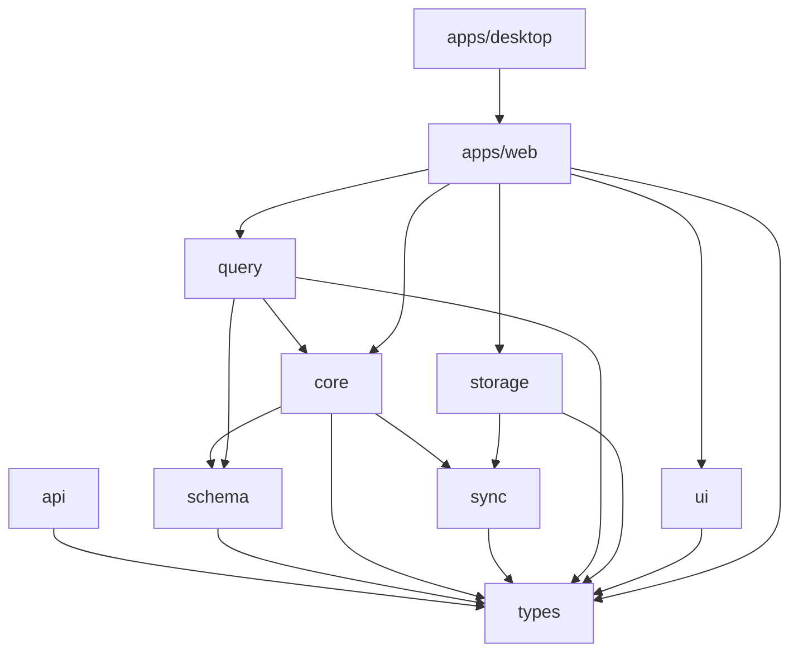

# Canopy

Canopy is a graph-based personal knowledge management system. It treats all content as nodes in a graph with strict typing, meta-circular definition capabilities, and CRDT-based synchronization for offline-first operation.

## Package Dependency Graph

## Architectural Invariants

1.  `@canopy/types` has zero runtime dependencies—pure TypeScript types only.
2.  `@canopy/core` owns the graph model—other packages do not directly manipulate graph state.
3.  Yjs integration lives in `@canopy/sync`, not scattered across packages.
4.  `@canopy/query` is isolated to enable swapping Cypher for ISO GQL later.
5.  UI components are stateless—`@canopy/ui` receives data via props, does not fetch or mutate.
6.  Zod schemas in `@canopy/schema` are the source of truth for runtime validation.
7.  All type properties are `readonly`.
8.  No mutations—functions return new values, never modify arguments.
9.  No raw primitives in domain types—use branded types and domain-specific wrappers.

## Development Workflow

To install dependencies, run `pnpm install` in the root directory.
To run tests, execute `pnpm test run`.
To build all packages, use `pnpm build`.
To lint the codebase, run `pnpm lint`.
To typecheck the codebase, run `pnpm typecheck`.

## Programming Style Requirements

All code must follow a functional programming style, avoiding mutations and side effects.
Use `readonly` modifiers on all type properties and prefer `ReadonlyArray<T>` or `readonly T[]`.
Build domain types from the bottom up, avoiding `any` or `Record<string, unknown>`.
Strict typing is enforced; use branded types for identifiers and `unknown` instead of `any` where appropriate.
Documentation in `AGENTS.md` files must follow the one-sentence-per-line rule.
