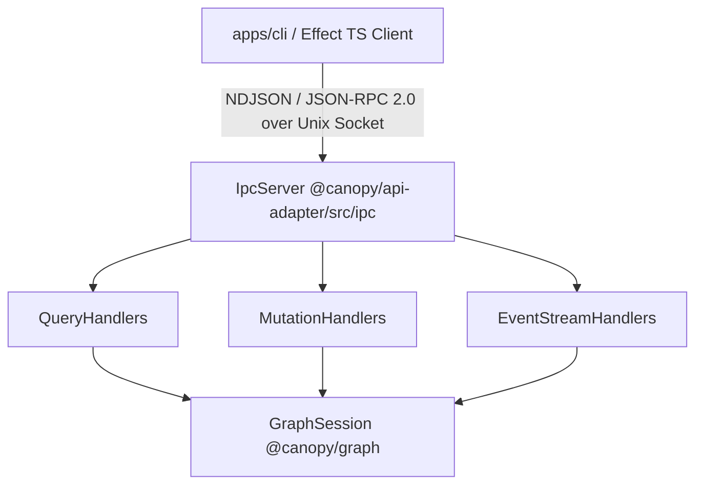

# Design: Unix domain socket IPC listener transport bridge (`canopy-pf0.1`)

## Context

Canopy client applications (such as `apps/cli` and headless background services) require a fast, lightweight, local-first Inter-Process Communication (IPC) transport to execute queries, trigger graph mutations, and subscribe to real-time event streams without running full HTTP/Web servers.

`@canopy/api-adapter` currently hosts core `QueryHandlers`, `MutationHandlers`, `EventStreamHandlers`, as well as protocol adapters for GraphQL, Connect-Web/gRPC, and WASM WIT.
This specification details the design of the Unix domain socket IPC listener transport bridge for `packages/api-adapter` and its consumption in `apps/cli`.

## Goals and non-goals

### Goals

- Implement a low-latency, zero-dependency IPC listener server in `@canopy/api-adapter/src/ipc/` over Node/Bun `node:net` Unix domain sockets.
- Frame messages using Newline-Delimited JSON (NDJSON) with standard JSON-RPC 2.0 payloads.
- Guarantee strict forward and backward compatibility (schema evolution rules, additive non-breaking fields, unknown field tolerance, and explicit capability handshakes).
- Expose unary queries, atomic graph mutations, and real-time event log subscription streaming over a single multiplexed socket connection.
- Ensure safe socket lifecycle management (strict `0o600` file permissions, stale socket probe & `ECONNREFUSED` cleanup, and graceful server shutdown).
- Integrate cleanly with Effect TS in `apps/cli` via `@effect/platform-node`.

### Non-goals

- Supporting TCP or remote network listening in this task (focus is strictly local Unix domain sockets).
- Replacing `@canopy/api-adapter` domain validation or kernel `GraphSession` ops.
- Adding third-party binary serialization frameworks (e.g. Protobuf/Cap'n Proto) for local IPC.

## Architecture and component boundaries



- `@canopy/api-adapter/src/ipc/` owns:
  - `createIpcServer`: Unix domain socket server factory.
  - `IpcServer`: Server lifecycle, client socket management, NDJSON buffering/parsing, and JSON-RPC dispatch.
  - `ipc-schema.ts`: JSON-RPC protocol types, request/response envelopes, error codes, and handshake contract.
- `apps/cli/src/ipc/` owns:
  - `IpcClient`: Effect TS client wrapper using `@effect/platform-node` socket streams for request correlation and event subscription management.

## Protocol design and schema compatibility

### Framing and payload format

- **Transport**: `node:net` listening on a Unix domain socket path (e.g., `/tmp/canopy.sock` or `~/.canopy/canopy.sock`).
- **Framing**: Newline-delimited JSON (`\n`). Every request, response, and notification must be a single JSON object terminated by `\n`.
- **RPC standard**: JSON-RPC 2.0 specification (`jsonrpc: "2.0"`).

### Forward and backward compatibility design

To match the compatibility guarantees of Protobuf/gRPC and GraphQL, the IPC protocol enforces five explicit compatibility rules:

1. **Additive non-breaking schema evolution**:
   - New response fields and request parameters are always optional/additive.
   - Servers and clients must ignore unknown JSON fields when parsing incoming payloads. Zod validation schemas on the IPC bridge use `.passthrough()` or explicit unknown property filtering instead of strict rejection.

2. **Protocol versioning and capability handshake**:
   - Every connection may perform an initial `canopy.v1.handshake` request:
     ```json
     {
       "jsonrpc": "2.0",
       "method": "canopy.v1.handshake",
       "params": {
         "clientVersion": "0.1.0",
         "supportedCapabilities": ["queries", "mutations", "subscriptions"]
       },
       "id": 1
     }
     ```
   - Server responds with server version, API version (`v1`), and supported capability set.

3. **Namespaced method evolution (`canopy.v1.*`)**:
   - All method names follow explicit versioned namespaces:
     - `canopy.v1.query.getNode`
     - `canopy.v1.query.getNodes`
     - `canopy.v1.query.getEdge`
     - `canopy.v1.query.getEdges`
     - `canopy.v1.query.executeQuery`
     - `canopy.v1.mutation.createNode`
     - `canopy.v1.mutation.updateNodeProperties`
     - `canopy.v1.mutation.deleteNode`
     - `canopy.v1.mutation.createEdge`
     - `canopy.v1.mutation.deleteEdge`
     - `canopy.v1.eventStream.subscribe`
     - `canopy.v1.eventStream.unsubscribe`
   - If a breaking method signature change is required in the future, it is introduced under a new version namespace (e.g., `canopy.v2.*`) while maintaining `canopy.v1.*` handlers.

4. **Nullable / default-fallback fields**:
   - Missing fields in request parameters fall back to safe defaults defined in Zod schemas.
   - Deprecated fields are maintained as optional properties with deprecation notices in docstrings.

5. **Canonical error mapping**:
   - Errors translate `Result<T, E>` into standard JSON-RPC 2.0 error codes:
     - `-32700`: Parse error (invalid JSON).
     - `-32600`: Invalid request.
     - `-32601`: Method not found.
     - `-32602`: Invalid params.
     - `-32603`: Internal error.
     - `-32000` to `-32099`: Canopy domain errors (e.g. NodeNotFound, MutationFailed, Unauthorized).

### Event stream subscriptions

To stream events over the socket:
1. Client sends request to `canopy.v1.eventStream.subscribe` with parameters `{ graphId?, fromSequence? }`.
2. Server responds with `{ jsonrpc: "2.0", result: { subscriptionId: "sub_123" }, id: reqId }`.
3. Server emits JSON-RPC notification objects for each event:
   ```json
   {
     "jsonrpc": "2.0",
     "method": "canopy.v1.eventStream.event",
     "params": {
       "subscriptionId": "sub_123",
       "event": {
         "id": "evt_...",
         "graphId": "graph_...",
         "type": "NodeCreated",
         "sequence": 42,
         "payload": { ... }
       }
     }
   }
   ```
4. Client sends `canopy.v1.eventStream.unsubscribe` with `{ subscriptionId: "sub_123" }` to terminate the stream.

## Server-side implementation (`packages/api-adapter/src/ipc/`)

### File structure
- `packages/api-adapter/src/ipc/ipc-schema.ts`: Request/response/notification schemas and Zod validators.
- `packages/api-adapter/src/ipc/ipc-server.ts`: `IpcServer` class and `createIpcServer` factory.
- `packages/api-adapter/src/ipc/ipc-handlers.ts`: Router mapping JSON-RPC methods to `QueryHandlers`, `MutationHandlers`, `EventStreamHandlers`.
- `packages/api-adapter/src/ipc/index.ts`: Re-exports IPC server API.

### Socket lifecycle & stale socket cleanup
1. **Probe**: Before calling `netServer.listen(socketPath)`, `createIpcServer` attempts a connection to `socketPath` using `net.connect`.
2. **Cleanup**: If connection fails with `ECONNREFUSED` or `ENOENT`, the socket file is stale; the server calls `fs.unlinkSync(socketPath)` to remove it cleanly.
3. **Collision guard**: If connection succeeds, another process is actively listening on the socket; server creation fails with `Result.err(new Error("IPC socket already in use"))`.
4. **Permissions**: Immediately after `listen()`, server calls `fs.chmodSync(socketPath, 0o600)` to ensure only the file owner has read/write access.
5. **Shutdown**: On `stop()`, server notifies active clients, closes connections, unbinds, and unlinks `socketPath`.

### Backpressure & stream safety
- Emitting subscription events checks `socket.write(payload)`. If `write` returns `false`, server pauses the event bus queue for that subscriber until the `drain` event fires, preventing memory exhaustion.

## Client-side implementation (`apps/cli/src/ipc/`)

- Built with Effect TS (`@effect/platform-node`).
- Manages connection lifecycle to Unix domain socket.
- Line-splits incoming data using standard newline buffer decoder.
- Dispatches response matching correlation `id` to pending `Deferred` tasks.
- Routes subscription notification events into an `Effect.Queue` / `Stream`.

## Adversarial review and mitigations

### Resource and performance
- **Risk**: Unbounded client messages or fast event streams overloading socket memory.
- **Mitigation**: Implement 10MB line buffer limit in NDJSON parser; enforce socket drain backpressure on subscription streaming.

### Failure modes and edge cases
- **Risk**: Unclean server exit leaving stale socket file or orphan client connections.
- **Mitigation**: Stale socket probe on startup (`ECONNREFUSED` -> `unlinkSync`); `SIGINT`/`SIGTERM` hooks for graceful `stop()`.

### Security and isolation
- **Risk**: Other local system users connecting to socket.
- **Mitigation**: Strict `0o600` file permissions on socket creation.

### Compatibility
- **Risk**: Schema changes breaking existing client binaries.
- **Mitigation**: `passthrough()` Zod validation for additive fields, `canopy.v1.*` versioned method namespaces, explicit `canopy.v1.handshake` capability exchange.

## Testing strategy

### Unit tests
- Test NDJSON line buffer parsing (partial chunks, back-to-back messages, long lines).
- Test JSON-RPC error mapping and Zod schema validation tolerance.

### Integration tests
- Test full socket lifecycle: server startup, `0o600` permissions verification, stale socket cleanup, client connection, unary query/mutation RPC calls, subscription event streaming, and graceful shutdown.
- Test forward/backward compatibility: client sending unknown extra fields; server returning additive fields.

---
